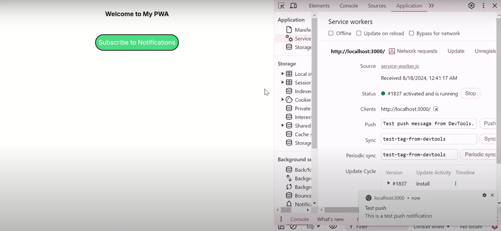

<h1>Notification PWA using Next.js</h1>

 

<h1>Overview</h1>
 

This project is a Progressive Web App (PWA) built with Next.js that implements push notifications. It is designed to work seamlessly on both desktop and mobile devices, providing users with timely updates even when the app is not actively in use.

<h1>Features</h1>
<ul>
  <li>Push Notifications: Receive real-time notifications directly in your browser.</li>
  <li>
Next.js App Router: Utilizes the latest features of Next.js with an App Router and TypeScript.</li>
</ul> 

<h1>Installation</h1>

Follow these steps to set up the project locally:

1.Clone the repository:

    git clone https://github.com/Fatima-Kabalan/next-pwa-notifications.git

    cd next-pwa-notifications

2.Install dependencies:

    npm install

3.Run the development server:

    npm run dev 

The app will be available at http://localhost:3000.

4.Build for production:

    npm run build

5.Start the production server:

    npm start
    
 
<h1>Usage</h1>

To use the PWA, follow these steps:
1.Open the app in your browser.
2.Allow notifications when prompted.
3.Interact with the app to trigger notifications.

<h1>Screenshot</h1>

This is a screenshot of the website, and you can click on it to see the video

Thank you for checking my github repository and I am always open for any contributions or advices!

